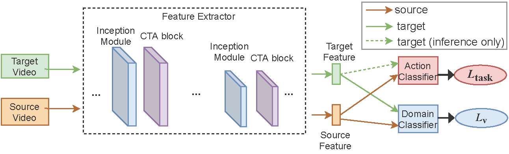

## First-Person Video Domain Adaptation with Multi-Scene Cross-Site Datasets and Attention-Based Methods

-----------------------------------------

### Introduction

This repository contains the PyTorch implementation of CTAN framework
on UDA for first-person action recogniiton.
CTAN is an adversarial channel-temporal attention network,
including an I3D backbone, channel- and temporal-wise attention modules,
and adversarial UDA modules, working on three datasets, EPIC-8, ADL-7 and GTEA_KITCHEN-6.

-----------------------------------------

### Framework

<p align="center">
  
</p>

-----------------------------------------

### Datasets

Prepare the datasets (EPIC-8, ADL-7 and GTEA_KITCHEN-6) following the guidances below and put them into `./data`.

#### EPIC-8
Download RGB frames from participants P01, P08 and P22 of the EPIC-KITCHENS-55 dataset, using
official download script [here](https://github.com/epic-kitchens/epic-kitchens-download-scripts).

#### ADL-7 and GTEA_KITCHEN-6
Follow the instructions in [EgoAction](https://github.com/XianyuanLiu/EgoAction).

-----------------------------------------

### Usage

Clone the repo

```
git clone https://github.com/XianyuanLiu/CTAN.git
```

Install the required packages

```
conda create --n ctan; conda activate ctan  (Optional)

# install pytorch
pip install torch==1.9.1+cu111 torchvision==0.10.1+cu111 torchaudio==0.9.1 -f https://download.pytorch.org/whl/torch_stable.html

pip install -r requirements.txt
```

Run CTAN for EPIC-8, ADL-7 and GTEA_KITCHEN-6 respectively 
(For more domains, please edit the yaml files in `./configs`)

```
python main.py --cfg configs/EPIC-D12D2.yaml

python main.py --cfg configs/ADL-D12D2.yaml

python main.py --cfg configs/G2K.yaml
```


-----------------------------------------

### Citation

```lang-latex
    @article{liu2021channel,
        title   = {Channel-Temporal Attention for First-Person Video Domain Adaptation},
        author  = {Liu, Xianyuan and Zhou, Shuo and Lei, Tao and Lu, Haiping},
        journal = {arXiv:2108.07846 [cs.CV]},
        year    = {2021}
    }
```

-----------------------------------------

### Acknowledgement

This implementation is based on early works [1] and [2].

-----------------------------------------

### References

```
[1] Haiping Lu, Xianyuan Liu, Shuo Zhou, Robert Turner, Peizhen Bai, ... & Hao Xu (2022). PyKale: Knowledge-Aware Machine Learning from Multiple Sources in Python. In Proceedings of the 31st ACM International Conference on Information and Knowledge Management (CIKM).
[2] Munro Jonathan and Damen Dima (2020). Multi-modal Domain Adaptation for Fine-grained Action Recognition. Proceedings of the IEEE Conference on Computer Vision and Pattern Recognition (CVPR)
```